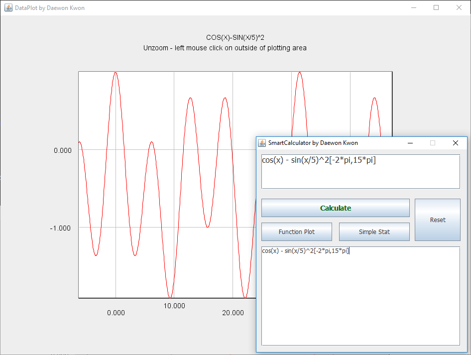

# DKSmartCalculator

## Functionality

1. [Simple Calculator](#simple-calculator)
2. [Simple Stat calculation](#simple-stat-calculator)
3. [Function plot](#function-plot)

## Simple Calculator

* Expression rules
  * Spaces, tabs, new lines can be added
  * Calculation order
    * Parentheses (simplify inside 'em)
    * Exponents(^), factorial(!)
    * Multiplication and Division (from left to right)
    * Addition and Subtraction (from left to right)
* Basic Functions (case is not sensitive)
  * ^ - power
  * ! - factorial
  * pi - 3.141592...
  * sqrt(x)
  * cos(rad), sin(rad), tan(rad)
  * acos(x), asin(x), atan(x)
  * rad(deg): deg --> rad
  * deg(rad): rad --> deg
  * exp(x)
  * ln(x): natural logarithmic function
  * log(x): base 10 logarithmic function
  * lg(x): base 2 logarithmic function
* Example Expressions
  * 2*(3 + (5^2 - 3*4)^2) - 3!
  * cos(rad(60)) : this will results in 0.5
  * cos(pi/3) : this will results in 0.5
  * deg(asin(0.5)) : this will results in 30 degrees
  * ln(exp(3.5)) : this will results in 3.5
  * log(10) : this will results in 1.0
  * lg(2) : this will results in 1.0

[Back to top](#dksmartcalculator)

## Simple Stat Calculator

1. Input list of values on top text area
2. Press "Simple Stat"

[Back to top](#dksmartcalculator)

## Function Plot

* How to plot a function
  * Input an expression
  * Press "Function Plot"
  * Note: Press and hold left mouse button to zoom. Click left mouse button on outside of plotting area to unzoom.
* Example Expressions
  * pol(x: 3.2, 2.5, 8) [-5.0,6.0]
  * 3.2 + 2.5 *x + 8 * x ^2[-5.0,6.0] : this is the same expression as the previous one
  * cos(x) - sin(x/5)^2[-2*pi,15*pi]

[Back to top](#dksmartcalculator)

### Copyright

Daewon Kwon © 2019. All Rights Reserved.